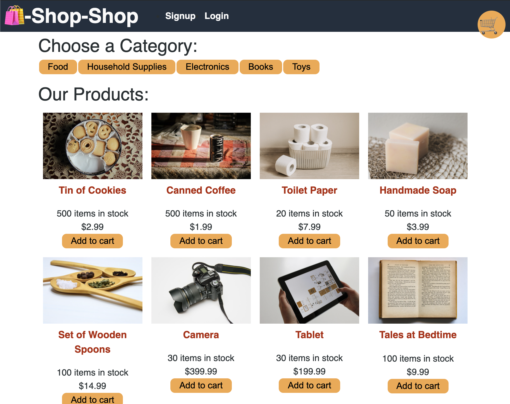

# Redux-Ecomm

## Description

An E-Commerce full stack application built with React, GraphQL, and a MongoDB Database. This app has been refactored to use Redux to manage a global state to prevent prop drilling. The app also includes the stripe api for test functionality and checkout. This app was refactored from a previous project [HERE](https://github.com/Jaydon-Goodrich/shop-shop).

## Table of Contents

* [Installation](#installation)
* [Usage](#usage)
* [Credits](#contributing)
* [License](#license)
* [Reference](#reference)

## Installation

* copy source code
* run npm install
* npm run seed
* run npm start

## Usage 

* The App can be found [Here]()
* Create an account by providing a username, email, and password
* Add items to your cart.
* Checkout the items from your cart.
* See previous orders.

## Contributing

The code for this project was written by Jaydon Goodrich

## Tests

Test can be run by running npm run test.
Tests can be found under __tests__.

## License

Code released under the [Unlicense](http://unlicense.org/)

****
    
## Reference

[Link to Deployed Site]()

